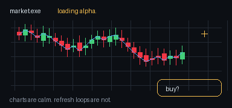

### Hi, I'm Fred

Building AI tools, chart dashboards, BeatSaber automappers, and useful little hacks.

I like turning noisy inputs into things you can actually use: crypto dashboards, music experiments, local AI apps, sensor projects, and prototypes that start with "what if this worked?"

  

  

  
  

  
  

